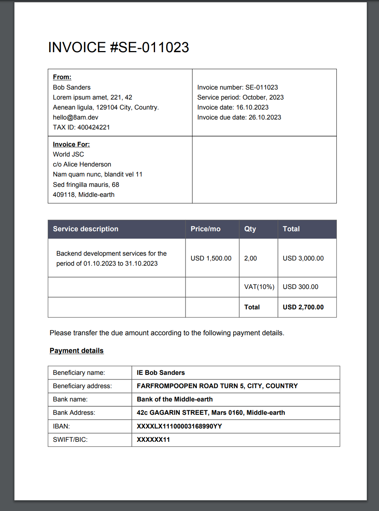

# Invoice-generator


Invoice-generator is a simple tool for automatically generating invoices. No
need to fill anything out every month, you set it up once, and it works.

It can be used for multiple projects simultaneously: just create different
configuration files and place them in separate folders where you want the
invoices to be saved.


## Installation

### Binaries

Pre-built [binaries](https://github.com/sesav/invoice-generator/releases/latest)

Download the binary file for your platform, copy it to `/usr/local/bin`, and
give execute permission. Here is an example of my configuration for Linux:

```shell
sudo wget https://github.com/sesav/invoice-generator/releases/latest/download/invoice-generator.linux-amd64 -O /usr/local/bin/invoice-generator
sudo chmod +x /usr/local/bin/invoice-generator
```

And for MacOS:

```shell
sudo wget https://github.com/sesav/invoice-generator/releases/latest/download/invoice-generator.darwin-arm64 -O /usr/local/bin/invoice-generator
sudo chmod +x /usr/local/bin/invoice-generator
```

### Build from source

Clone the repo:

```shell
git clone https://github.com/sesav/invoice-generator.git
```

Install [just](https://github.com/casey/just) command runner, then run:

```shell
just install
```

You can also build for all platforms:

```shell
just build
```

## Configuration

If you run the invoice generation for the first time without an
`invoice-generator.toml` file in the directory, the program will ask you a
question:

```shell
The file invoice-generator.toml was not found in the current directory. Want to create it? (Y/n)
```

Type `Y`, then open the generated `invoice-generator.toml` file and fill in your
invoice parameters. Once this is done, the configuration setup is complete and
you can start generating invoices.

## General usage

To generate a new invoice, run the following command:

```shell
invoice-generator g
```

In addition, you can specify the date (month.year) of the desired service period
as an argument, as follows:

```shell
invoice-generator g 10.2023
```

You will receive an invoice for the desired period (for example, the previous
month) with the correct dates in all relevant fields.

## Help information

```shell
$ invoice-generator
NAME:
   invoice-generator - cli invoice assistant

USAGE:
   invoice-generator [global options] command [command options] [arguments...]

VERSION:
   0.9

DESCRIPTION:
   This is a simple tool for automatically generating invoices. No need to fill anything out every month, you set it up once, and that's it.

COMMANDS:
   generate, g  Generate a new invoice based on the information in invoice-generator.toml and the current date.
                Alternatively, you can provide the date (month.year) for the desired service period as an argument, like this: invoice-generator g 10.2023

   help, h      Show a list of commands or help for a specific command.

GLOBAL OPTIONS:
   --help, -h     show help
   --version, -v  print the version
```

### Invoice example:

<div align="center">

</div>

## Requirements

There are no requirements or additional dependencies, it works on Windows, Linux, and macOS.


## License

Open sourced under the [MIT license](LICENSE).
